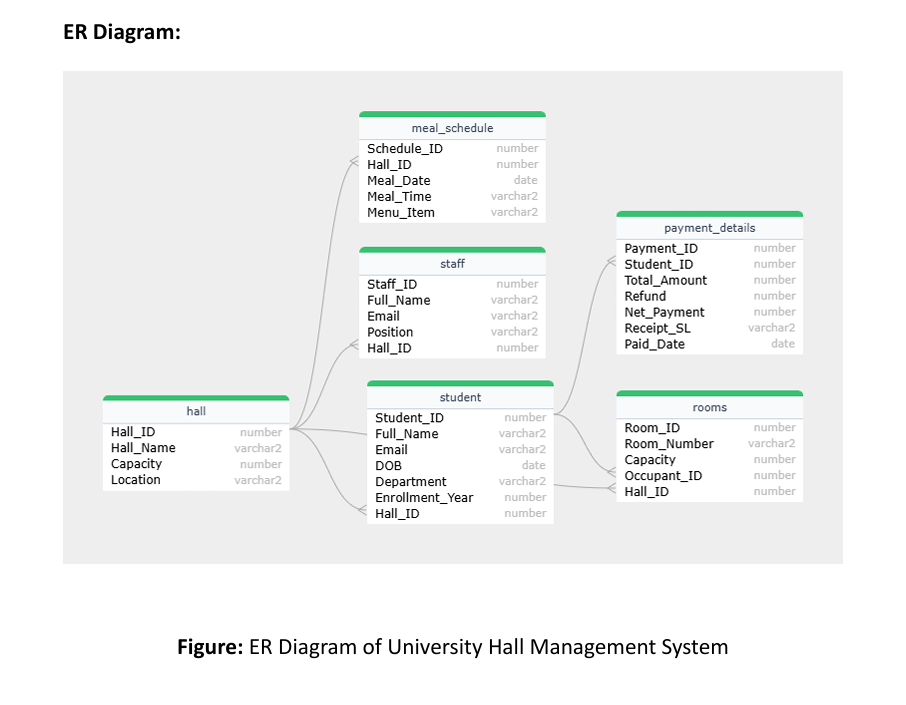

# Hall Management System

This repository contains a complete Hall Management System implemented using **Oracle SQL** and **PL/SQL**. It manages university hall operations such as student allocations, room management, staff records, meal scheduling, and payment tracking.

## Files in This Repository

- **hall_management_system.sql**  
  Main SQL script that includes:
  - Table creation
  - Sample data insertion
  - Data manipulation queries
  - Set operations and joins
  - PL/SQL blocks (cursors, loops, exception handling)
  - Procedures

- **Project report.pdf**  
  Detailed project documentation and explanation of design, entities, and relationships.

- **README.md**  
  Overview and guide for using the project.

## Key Features

- Manage multiple halls with capacities and locations
- Assign students and staff to specific halls
- Room allocation and modification
- Daily meal scheduling per hall
- Track student payments including refunds
- Includes:
  - Joins (INNER, OUTER, NATURAL, SELF)
  - Aggregation and filtering queries
  - Subqueries and set operations
  - PL/SQL procedures and cursor-based blocks

## ER Diagram

*Figure: ER Diagram of University Hall Management System*

## How to Run

1. Open **Oracle SQL Developer** or any compatible SQL client.
2. Run `hall_management_system.sql` in the SQL worksheet.
3. Explore queries and outputs using `SELECT` statements.
4. Review the PL/SQL blocks and procedures at the end of the file.

## Requirements

- Oracle Database (tested on Oracle 11g+)
- SQL Developer or any SQL execution environment

## Contribution

This project was developed as part of an academic assignment for understanding SQL/PLSQL in database systems.
